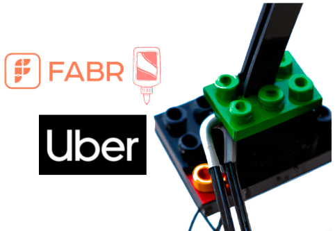
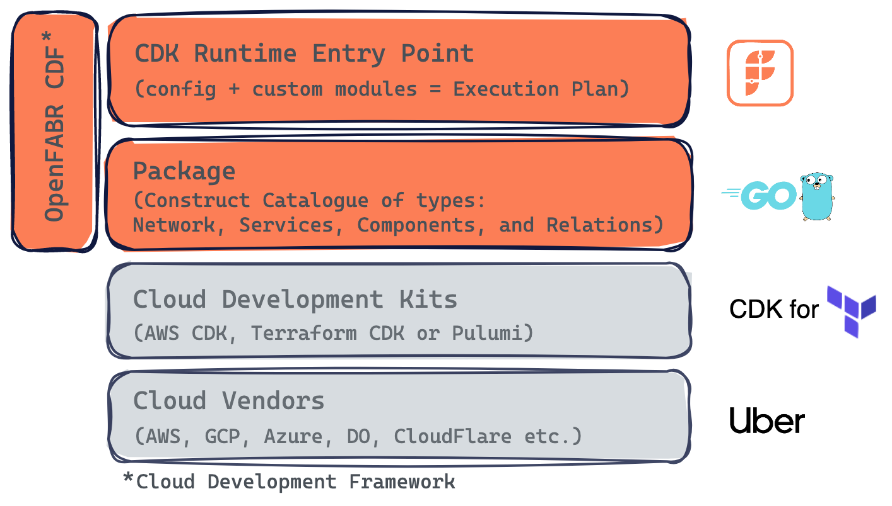

*This is part of the `Glue` series introducing FABR, including [OpenFABR CDF](https://github.com/openfabr/cdf) and [FABR Infra](https://fabrhq.com), in real-world scenarios where actionable recommendations can be applied to solve infrastructure challenges.*

On Uber's [Engineering Blog](https://www.uber.com/blog/engineering/), there is an insightful post about [Crane: Uber's Next-Gen infrastructure Stack](https://www.uber.com/en-GB/blog/crane-ubers-next-gen-infrastructure-stack/) that reveals many intrigue details about the effort behind rebuilding Uber's infrastructure. 

A few surprising facts from the post:

- It was a mix of on-prem and cloud, moving towards a true multi-cloud setup.
- Manual operations were still prominent, moving towards "cattle, not pets", i.e. push for automation.
- Having circular dependencies among infrastructure components was a challenge, to be eliminated.

There are in-depth descriptions of how Uber tackles those challenges throughout the post, which makes an excellent read.

We thought it would be a fun thought experiment to run through how FABR could help resolve some of the challenges.

*Disclaimer: There are NO commercial interests between FABR and Uber as of the time of this blog post.*

## Repeatable infrastructure & Layered Dependencies

The *Zone Turn-Up* section of the post describes two challenges:

- Manual infrastructure management - made it slow to spin up a new zone. They adopted Infrastructure-as-Code (IaC) to solve it which is a natural choice.
- Circular dependencies - among infrastructure components made it even more challenging to spin up a new zone. Adopting their *Layered Dependencies* approach for infrastructure services was their approach here. A variation of the typical DAG in dependency management.

And the consequence of not fixing the two issues was significantly reduced the time to spin up a new zone, from months to days.

### Using OpenFABR CDF

OpenFABR CDF is a framework for building IaC using imperative programming languages like TypeScript, Python, or Golang. It is the [glue](https://openfabr.github.io/cdf/user-guide/overview/) that gives IaC the full software lifecycle support. In this case, the likes of CDK for Terraform, paired with Golang as the programme language of the choice, would fit Uber's infrastructure implementation as described in the post.

With imperative Iac, building blocks (`constructs` as described in [some](https://docs.aws.amazon.com/cdk/v2/guide/constructs.html) [frameworks](https://developer.hashicorp.com/terraform/cdktf/concepts/constructs)) can be developed, tested and then published just as normal software packages, perhaps in *Golang* as the post mentioned. Once they are in Go package repository, they can be imported as dependencies and used in other IaC codebase.

Speaking of dependencies, transitive dependencies can cause the circular dependencies problem as mentioned earlier, however some dependency-focused static code analysis tools could pick out abnormal inter-layer dependencies easily, similar to how [GitHub Dependabot](https://github.com/dependabot) works.

By adopting OpenFABR CDF, a complex infrastructure like Uber's could be designed and implemented from small, single-purpose components all the way up to powerful high-level packages that are developer-facing for them to self-manage their own pieces of infrastructure.

## Config & Change Management

The *Config and Change Management* section of the post started with what research and discovery they underwent to decide on how developers would interact with the infrastructure automation. They settled on [Starlark](https://github.com/bazelbuild/starlark) which is a better alternative to the usual JSON/YAML camp. 

There was also some brief discussion about developer experience. 

### Using OpenFABR CDF and FABR Infra

Firstly, CDF defines an open standard for an extensible configuration format, tied to individual infrastructure packages. So by selecting CDF you get an integrated configuration format out-of-the-box.

Secondly, CDF aims to establish an abstraction layer between platform and product functions in any engineering organisation so that you do not have to spend time researching and discovering the optimal UI/UX for application developers.

Last but not least, our SaaS product FABR Infra offers great convenience for developers to discover, experiment and utilise top-level infrastructure components published by the platform team. Features such as rollback and release history are built into the product. That saves platform engineering effort custom implementing such DX functionality.

## Example Setup with FABR

Given that the post did not share specifics about Uber's architecture, let's use a very simple infrastructure setup here for ease of understanding:

- A public-facing web server on cloud vendor A;
- An on-prem database;
- Another database on cloud vendor B;
- The web server should have connectivity to both databases.

Given the on-prem and multi-cloud nature of the infrastructure mentioned in the post, we will pick [CDK for Terraform](https://developer.hashicorp.com/terraform/cdktf) as the imperative IaC tool, with some help from [Golang](https://go.dev/) which is also mentioned in the post.

Let's see how we achieve this with FABR within a large, established engineering organisation such as Uber's, with both platform teams and product teams:

1. First develop a Terraform provider for our on-prem infrastructure (assuming it's not based on an off-the-shelf stack that has a provider).
2. Develop a package with small, single-purpose, constructs for provisioning a database and web server on-prem and the cloud.
3. Then develop another package at a higher level to include the packages in step 2, plus a few other existing packages such as networking to establish connectivities between the web server and the two databases. 
4. The platform teams will consider the developer-configurable attributes for the web server and the two databases, such as those related to CPU and memory allocation, according to what OpenFABR CDF lays out.
5. Write automated tests using you favourite Go test framework.
6. The platform teams will then publish the high-level package which contains the constructs for the on-prem database, cloud database, and one web server. Constructs in CDF are typed. The databases are type `Component`, the web server type `Service` (any code deployment target), connectivity between then represented by construct type `Relation`. These are automatically exposed to developers in product teams via the FABR Infra UI.
7. Now product engineers can make use of the package by creating a CDF-based configuration file to compose the proposed infrastructure setup earlier.
8. FABR offers two ways for product teams to spin up infrastructure like this:
  - Keep everything in the version control system and use OpenFABR CDF directly in your project with a CI/CD pipeline set up. In this example it would be a standard Terraform CI/CD setup that runs `terraform apply`.
  - Use FABR Infrastructure, click the `Launch` button.
9. Additionally, product engineers can write custom code blocks in Go in the format defined by the package. This allows infra customisation for particular product needs. The code will then be reviewed by platform engineers, just like what a good software engineering process should be. 
10. Rinse and repeat to fine-tune:
   1. For the platform teams, Step 1-6.
   2. For the product teams: Step 7-9.
11. :rocket: :money: (or whatever metrics you are tracking).

One note about package design and implementation: here we use step 2 to build foundational building blocks and in step 3, for a developer-facing package that adds glue-code such as network and permissions in the final package. An alternative is to lump them together into one package, which is perhaps the approach that most people using FABR will start with. Over time and especially when building complex infrastructure, splitting them will offer more reuse opportunities, just like how you design and implement your application code with [DRY](https://en.wikipedia.org/wiki/Don%27t_repeat_yourself). 

## Summary

The original post from Uber is a case of an engineering-heavy large scale-up re-thinking and re-architecting infrastructure to better serve the entire engineering organisation. Ultimately it is about reducing the time, cost, and risk around making engineering changes.

In our view:

- **IaC** is the centre piece of the implementation, enabling automation.
- **Abstraction** is the keyword given the mix of on-prem + multi-cloud. Because asking developers to understand and then utilise different infrastructure components with different characteristics is considered unrealistic and unattainable. Resulting in a small platform or infrastructure team being a bottleneck.

By adopting [OpenFABR CDF](https://github.com/openfabr/cdf) (our OSS project) and [FABR Infra](https://fabrhq.com) (our SaaS product), we think there are immediate benefits:

- It becomes drastically easier to develop, test, and package infrastructure components in such a mixed infrastructure environment. CDF is designed to make this task easier for infrastructure package authors.
- The standardised configuration format defined by CDF's modular approach not only makes config and change management easier, but also offers a free abstraction layer between organisation-wide shared infrastructure platforms and developers in the same organisation.
- With the adoption of FABR Infra, developer experience around infrastructure self-service is drastically improved. Developers can easily discover and use top-level infrastructure components and services made available to them.

*If you have infrastructure challenges similar to Uber's, we would love to chat.*