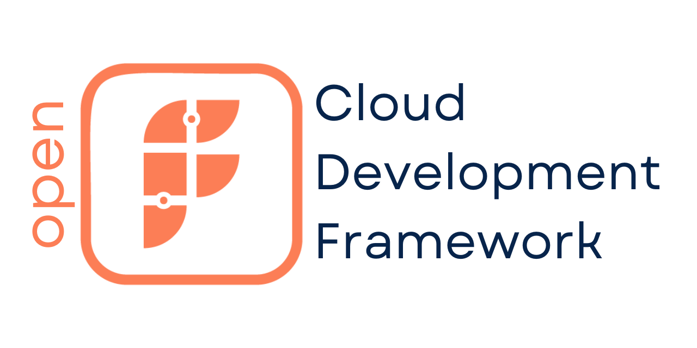

We talked to people in the trenches #building #cloudinfrastructure and now we delivered: Introducing #openfabr Cloud Development Framework (CDF) - FABR's view encapsulated in an #opensource project on the future of #devops with imperative #infrastructureascode [https://github.com/openfabr/cdf](https://github.com/openfabr/cdf).

In short, we believe that MODULAR + CUSTOM is the future of DevOps propelled by three emerging trends:

- (Imperative) #IaC: the likes of #awscdk from Amazon Web Services (AWS) and #cdktf from HashiCorp's #terraform are gaining momentum among developers
- #containerisation: music to many ears in recent years seeing the likes of #k8s and cloud vendors' proprietary container services gaining wide adoption
- And #platformengineering: big tech have been building their internal cloud platforms for years; democratising the concept has never been closer to reality among engineering organisations of different sizes and industries.

This is for you, the #developers who always like to tinker. You have had #rubyonrails to #ruby, #springboot to #java and countless #nodejs and #react frameworks to #javascript / #typescript, all of which gave you a huge productivity boost. It is time for that #framework to emerge for DevOps. It is #openfabr CDF.

Go check it out and tell us what you think through all the channels made available to you. Thank you!

Supporting #aws by Amazon | #gcp by Google | #azure by Microsoft | DigitalOcean | Cloudflare and more to come