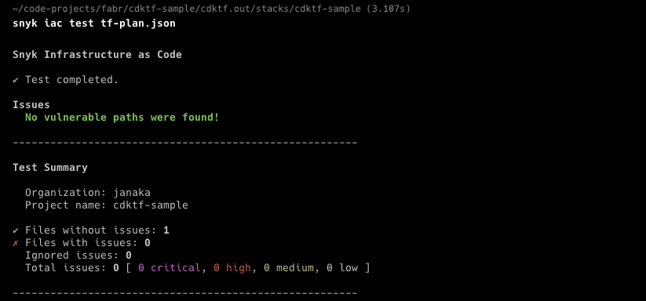

_This is part of the HOW-TO series on things related to Imperative Infrastructure-as-Code._

Let’s explore how to use [Snyk](snyk.io) to sniff out security issues in your [CDK for Terraform](https://developer.hashicorp.com/terraform/cdktf)(CDKTF) cloud infrastructure.

Skip to the next section if you know _why_ you should pay attention to cloud infrastructure security. Otherwise please read on.



## Why do we need this?

Cloud infrastructure covers a lot of security and recoverability out-of-the-box, compared to running one's own data centre. However, that doesn’t mean an application and its data will be “fully” secure. We still need to pay attention to how the infrastructure is set up and how the application is built. Imagine the full application stack as a layer cake, from the application to the physical data centre environment. When operating your own data centre you are responsible for the security of **all** the layers. But when using cloud infrastructure you are only responsible for some of the layers, at the top of the cake. Your cloud provider is wholly responsible for the lowest layers.

Everything the cloud infrastructure service consumer (you and I) can control is a potential attack vector. We need to think about these. They fall into at least two buckets:

- Cloud infrastructure service configuration e.g.: configuring AWS S3 bucket as public or private. Security groups on EC2 instance. IAM Policies.
- Applications you run on cloud infra. These could have security defects in the code or a third-party dependency it uses
  - Application code you have written e.g.: your JAM Stack or Spring Java app
  - Third-party software you self-host on the cloud. E.g.: Wordpress site, WooCommerce, Magento

A scanning tool can help catch and fix issues before they slip through to production. It gives you a mechanism to codify, share, and automate checks which is very important. This is especially important as engineering teams grow. Snyk happens to have products that apply to both the categories above. But in this post, we’ll focus on just cloud infrastructure.

To be clear, I’m not implying that cloud-sourcing makes those lowest-layer vectors magically disappear. Of course not, they still exist from a risk perspective. Rather you are paying and trusting your cloud provider to apply the right treatment as the specialist.

Note, I put the word _fully_ in double quotes above. When I started my first job in tech, a long while ago, I remember reading this particular article about securing Internet infrastructure. It said, if you want something to be 100% secure from the Internet baddies, then don’t connect it to the Internet! For an online application not-connecting-to-the-Internet isn’t an option obviously, so we have some work to do.

For the benefit of newbies, such a scanning tool should never be the start and end of your security strategy. Getting into the details of _what is a good security strategy?_ is beyond the scope of this post.

But with cloud infrastructure, given its programmable and inspectable nature with APIs and IaC, this type of tool gives us an extra security defence option.

## How does Snyk work with Infrastructure?

If you’ve heard of Snyk it’s probably because of their package (like NPM) vulnerability product, their core product. Snyk currently also have two products that fall into the infrastructure layer of the stack:

- Snyk Infrastructure-as-Code - detects cloud infrastructure vulnerabilities and policy violations based on configuration.
- Snyk Container - scans base container images for vulnerabilities. This is at the OS level.

Snyk IaC is the tool we are going to use. At a high-level Snyk IaC supports two approaches:

- Scanning the code - currently supports Terraform, AWS CloudFormation, Azure Resource Manager, and Kubernetes (manifest files which include the likes of Helm charts).
- Scanning the plan - currently supports plan output from Terraform and CloudFormation.

The Snyk CLI IaC command gives you the broadest support as opposed to the Github integration.

Snyk IaC doesn’t support scanning the imperative CDK code (AWS or TF; a static code analysis tool may help, but that’s for another blog post). So the approach is to use the CDKTF CLI to generate a plan from your CDKTF project, saved to a file. Then run the Snyk CLI against the file.

>Snyk IaC has a comprehensive set of [predefined security rules](https://snyk.io/security-rules), based on industry benchmarks, cloud-provider best practices, and threat model research from Snyk’s security intelligence team.

Snyk follows a pretty standard model. They have a database of vulnerabilities. Each vulnerability has a unique ID, severity rank, and some rules that codify how to detect it. The scanning engine runs your environment through the relevant rules. Generally, there’s also more context about the issue to help you decide on remediation. Sometimes this might include automated fixes or recommended solutions. In the end, a report is generated with details of any matches. The database is constantly updated as new vulnerabilities are discovered and cloud vendor products change. This is basically how the virus scanner on your computer works. Specifically with Snyk the environment in your IaC project. The rule set is narrowed down by what they call the ecosystem (AWS, Azure, GCP or K8s at present).

Snyk IaC uses Open Policy Agent and its Rego language as building blocks. They do support leveraging this to create custom rules. However, at this time it seems this is only available on the Enterprise plan. See [Build your own custom rules](https://docs.snyk.io/scan-cloud-deployment/snyk-infrastructure-as-code/custom-rules) in Snyk docs for more details.

## Prerequisites

- Create a Snyk account, if you don’t have one, then login. A free plan is available at the time of writing.
- Install Snyk CLI by following their guide [Install or Update the Snyk CLI](https://docs.snyk.io/snyk-cli/install-the-snyk-cli).
- Run `snyk auth` to associate your machine with your Snyk account (i.e. automatically generate a token).
- Assume you have the following installed:
  - Cdktf CLI
  - Terraform CLI

## How-to: Scan CDKTF Config

Config scanning doesn’t cover modules you may have referenced. To get full coverage you need to scan the plan.

- Change into your CDKTF project directory.
- Run `cdktf synth` to generate the TF config files in JSON. Defaults to `--output=”./cdktf.out”`.
- Run `snyk iac test`  to scan the configuration. You can add `--report` to push results up to Snyk and view in the web UI.

## How-to: Scan CDKTF Plan

- Run `cdktf synth`
- Run `cd cdktf.out/stacks/<your-project-name>`
- Run `terraform init` if you don’t do this you will be prompted to do so. 
- Run `terraform plan --out=tfplan.binary`  to output a plan in binary format.
- Run `terraform show -json tfplan.binary > tf-plan.json` to convert the plan from binary to JSON format
- Run `snyk iac test tf-plan.json` to scan the plan JSON file that was generated in the previous step.You can add `--report` to push results up to Snyk and view in the web UI.

## How-to: Tell Snyk to Ignore Specific Issues

- Either run `snyk ignore` which generates a `.snyk` policy file
- Or manually create a `.snyk` file into the root of your projects
- Then add policies to the file in the following format. The `*` means all instances in all files of this vulnerability ID. 

```yaml
  version: v1.19.0
  ignore:
    SNYK-CC-K8S-1:
      - '*':
        reason: None Given
        expires: 2021-08-26T08:40:35.249Z
        created: 2021-07-27T08:40:35.251Z
```

For full detials see [IaC ignores using the .snyk policy file](https://docs.snyk.io/scan-cloud-deployment/snyk-infrastructure-as-code/snyk-cli-for-infrastructure-as-code/iac-ignores-using-the-.snyk-policy-file)

## How-to: Config VS Code to Scan CDKTF

The Snyk VS Code extension has support for Snyk IaC and it’s enabled by default. For a little more detail [Visual Studio Code extension analysis results: Snyk IaC Configuration](https://docs.snyk.io/ide-tools/visual-studio-code-extension/visual-studio-code-extension-analysis-results-snyk-iac-configuration).

Install the VS Code extension. See [Install the extension](https://docs.snyk.io/ide-tools/visual-studio-code-extension#install-the-extension).
Authenticate with your Snyk account

---
References:

- [Snyk IaC CLI User Guide](https://docs.snyk.io/scan-cloud-deployment/snyk-infrastructure-as-code/snyk-cli-for-infrastructure-as-code)
