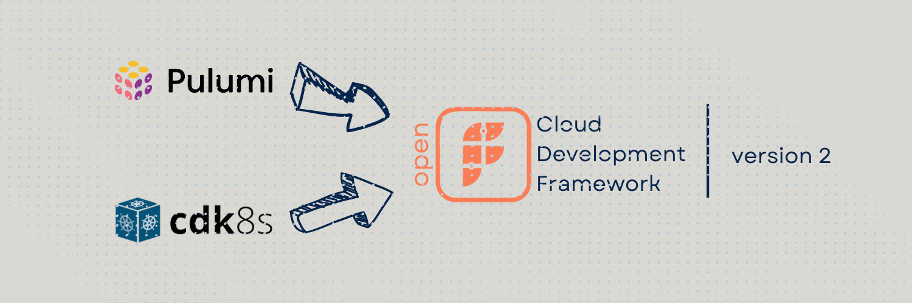

Since the launch of [OpenFABR CDF](https://github.com/openfabr/cdf) in November 2022, we have been busy bringing the framework to more IaC runtimes. With **V2**, you can implement packages in [cdk8s](https://cdk8s.io/) and [Pulumi](https://pulumi.com), which covers the majority of the imperative IaC landscape. 

The use cases of these two can be quite different, according to the views *in the field*:
- We have seen many large engineering organisations offering varying degree of customisation to engineers in product teams to customise their k8s provisioning. With **cdk8s** and now OpenFABR CDF V2, [managing k8s resource](https://kubernetes.io/docs/concepts/cluster-administration/manage-deployment/) can be easily built into an abstraction layer integrated into organisations' [GitOps](https://www.gitops.tech/) and/or [internal developer platform](https://internaldeveloperplatform.org/). Technically, it is influenced by [AWS CDK](https://aws.amazon.com/cdk/) with a smaller set of constructs corresponding to core K8s concepts, making it ideal for the use case. 
- On the other hand, **Pulumi** has gained popularity among application developers as a viable option for multi-cloud imperative IaC when we conduct our field interviews in the second half of 2022, alongside [Terraform CDF](https://developer.hashicorp.com/terraform/cdktf) which remains new to the scene. We are big fans of Pulumi at [FABR](https://fabrhq.com) and share many visions of where DevOps move towards, such as their [Crosswalk for AWS](https://www.pulumi.com/docs/guides/crosswalk/aws/) initiative. This release is hopefully the beginning of more collaboration in the future. 

Go check it out and tell us what you think through all the channels made available to you. Thank you!

*We are in the process of bringing out more **tutorials** addressing all 4 IaC runtime CDF supports for package authors. A **CLI package** is also in the making to help bootstrap new packages and projects built atop OpenFABR CDF.*

